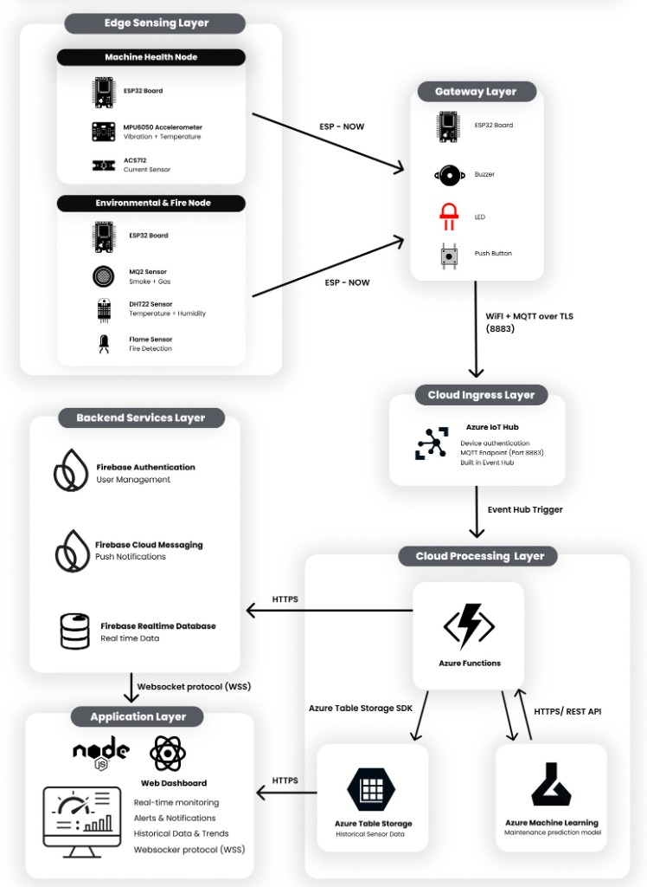

# Industrial Safety Monitoring System using IoT


This project presents a Cloud-Based Industrial Predictive Maintenance and Safety Monitoring System for industrial environments. The system monitors machine conditions and environmental safety in real time. Sensor data is sent to the cloud for storage, analysis and display through a web based dashboard. It also uses machine learning to identify possible machine failures and provide early maintenance warnings. This helps improve worker safety, reduce machine downtime and increase operational efficiency.

---

## 🖼️ System Documentation

### End-to-End System Architecture


---

## 🏗️ System Architecture & Data Flow

This project implements a multi-layered IoT architecture for real-time safety monitoring and AI-driven predictive maintenance:

1. **Edge Sensing Layer**:
   * **Machine Health Node**: Powered by an ESP32 micro-controller reading physical metrics (vibration & motor temperature via MPU6050, amperage draw via ACS712).
   * **Environmental & Fire Node**: Powered by an ESP32 reading surroundings (ambient temperature & humidity via DHT22, smoke density via MQ2, fire/flame presence via a Flame Sensor).
   * **Local Communication**: Edge nodes communicate with the local gateway via the lightweight **ESP-NOW** wireless protocol.

2. **Gateway Layer**:
   * An ESP32 Gateway node coordinates the edge sensors and acts as a bridge. It manages local alerts (buzzers/LEDs) and safely transmits telemetry to the cloud using **WiFi + MQTT over TLS (Port 8883)**.

3. **Cloud Ingress & Storage Layer**:
   * **Azure IoT Hub**: Authenticates devices securely using SAS tokens, ingests raw MQTT telemetry streams, and routes messages to a built-in Event Hub.
   * **Azure Functions**: Automatically triggered by new Event Hub entries to parse raw JSON payloads, fetch AI maintenance predictions, and update storage services.
   * **Azure Machine Learning**: Hosts the classification ML model (trained via Azure AutoML) which evaluates telemetry inputs (vibration, current, temperature) and outputs if a machine is `Healthy (0)` or if `Maintenance is Recommended (1)`.
   * **Azure Table Storage**: Used as a high-performance, cost-effective historical telemetry log for big data archiving.

4. **Realtime Backend & Application Layer**:
   * **Firebase RTDB**: Azure Functions pushes parsed live values directly to Firebase, which syncs them instantly to the React frontend dashboard via WebSockets (`WSS`).
   * **Firebase Authentication**: Handles secure login and access control for supervisor portals.
   * **Firebase Cloud Messaging (FCM)**: Dispatches instant push notifications to supervisors for critical safety breaches even if the browser dashboard is closed.
   * **React Web App**: Displays real-time gauges, active sirens, interactive charts loaded from Azure Table Storage, and a chronological log of safety alerts.

---

## 🚀 Key Features

*   **Real-time Dashboard**: Displays live metrics (vibration, current, temperature, smoke density, and flame presence) across different industrial sectors (Warehouse, Production Area, etc.).
*   **Predictive Maintenance**: Shows AI-driven machine health status indicators recommending preventative inspection.
*   **Interactive Analytics Graphs**: Beautiful line charts depicting historical telemetry patterns.
*   **Safety Audit Logs**: chronological log of active and acknowledged safety alerts with alarm sounds on threshold breach.
*   **Push Notifications**: Integrated Firebase Cloud Messaging (FCM) to trigger instant alerts for supervisors in the foreground and background.

---

## 🛠️ Tech Stack

*   **Frontend**: React 19 (TypeScript), Vite, Tailwind CSS v4, Lucide Icons
*   **State Management**: Zustand
*   **Realtime Backend & Auth**: Firebase Auth, Firebase Cloud Messaging, Firebase Realtime Database
*   **Telemetry Ingestion & ML**: Azure IoT Hub, Azure Functions, Azure Machine Learning (AutoML)
*   **Historical Telemetry**: Azure Table Storage (`@azure/data-tables`)

---

## 📋 Prerequisites

Ensure you have the following installed on your machine:
*   [Node.js](https://nodejs.org/) (v18+ recommended)
*   [npm](https://www.npmjs.com/)

---

## ⚙️ Setup & Configuration

1. **Install Dependencies**:
   ```bash
   npm install
   ```

2. **Environment Variables**:
   Create a `.env` file in the root directory of the project and populate it with your Firebase and Azure Table Storage credentials:
   ```env
   # Firebase Config
   VITE_FIREBASE_API_KEY=your_firebase_api_key
   VITE_FIREBASE_AUTH_DOMAIN=your_firebase_auth_domain
   VITE_FIREBASE_PROJECT_ID=your_firebase_project_id
   VITE_FIREBASE_STORAGE_BUCKET=your_firebase_storage_bucket
   VITE_FIREBASE_MESSAGING_SENDER_ID=your_firebase_messaging_sender_id
   VITE_FIREBASE_APP_ID=your_firebase_app_id
   VITE_FIREBASE_DATABASE_URL=your_firebase_database_url

   # Azure Table Storage Config
   VITE_TABLE_SAS_TOKEN="your_azure_storage_sas_token"
   ```

---

## 💻 Running the App

### Start the Development Server
Runs the app in development mode with hot-reloading:
```bash
npm run dev
```
Open [http://localhost:5173](http://localhost:5173) in your browser to view the supervisor portal.

### Build for Production
Compiles the TypeScript code and bundles the assets for deployment:
```bash
npm run build
```

### Preview Production Build
Runs a local web server to preview the built application:
```bash
npm run preview
```

---

## 📂 Project Structure

```
├── public/                 # Static assets (favicons, service worker)
├── src/
│   ├── assets/             # Images and design logos
│   ├── components/         # Reusable UI components (Sidebar, Topbar, Modals)
│   ├── config/             # Firebase and Threshold configurations
│   ├── hooks/              # Custom hooks (Store, Alarm, Dashboard, AreaHistory)
│   ├── pages/              # Views (Dashboard, History, MachineHealth, Alerts)
│   ├── services/           # Api services (Firebase RTDB, Azure Table Storage)
│   ├── types/              # TS interfaces & declarations
│   ├── App.tsx             # Main routing and global state hook setup
│   └── main.tsx            # Main application entry point
├── package.json            # Scripts and dependency list
└── vite.config.ts          # Vite build configuration
```
